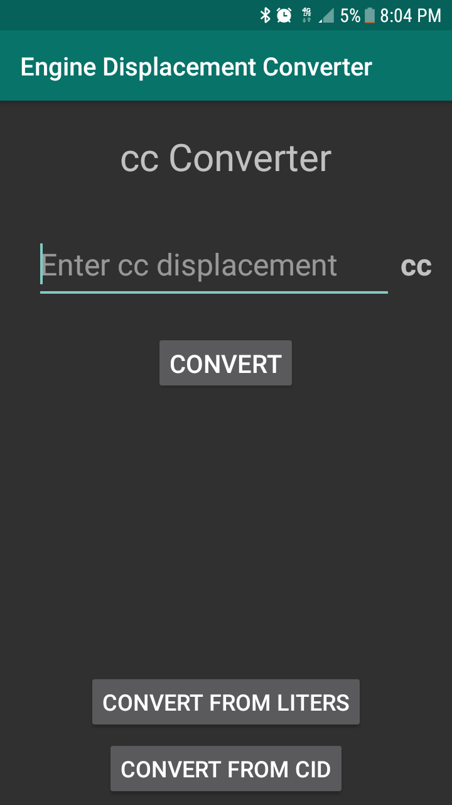
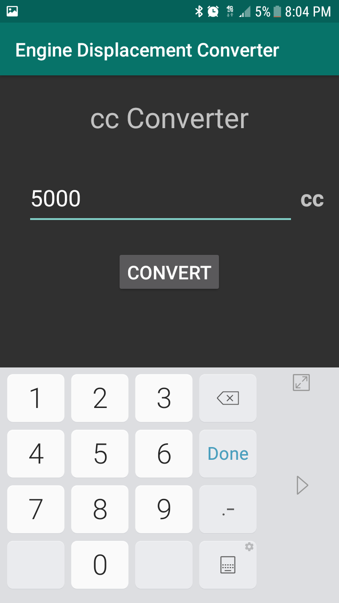
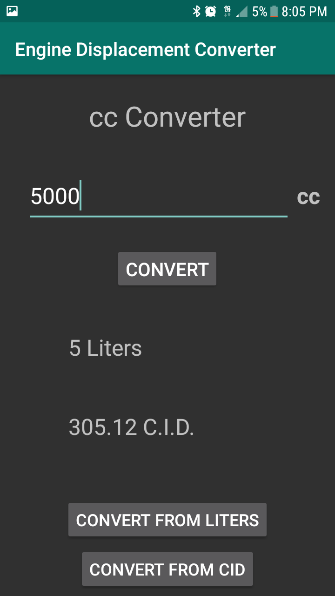
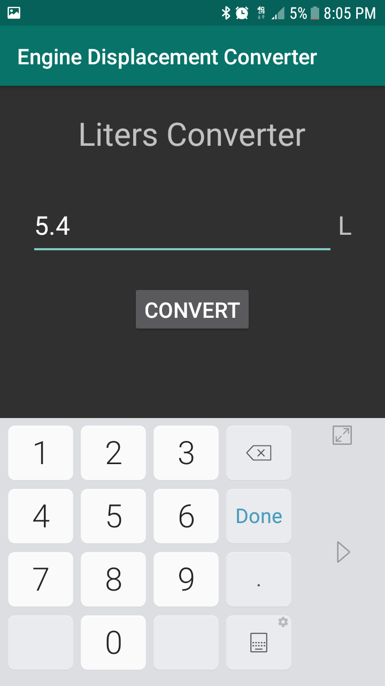
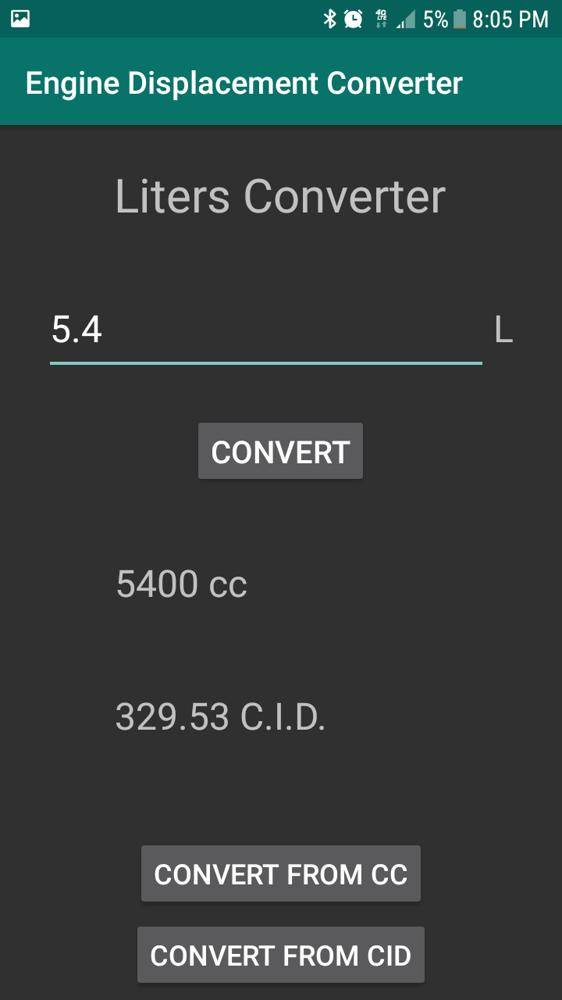
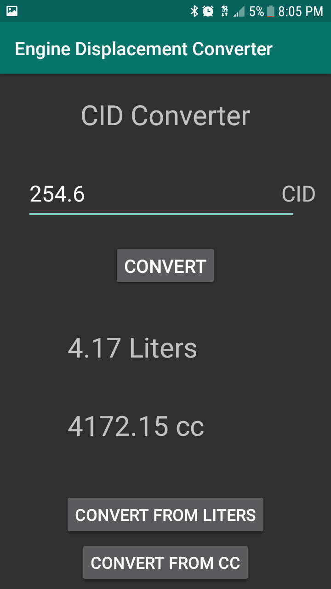

# Engine Displacement Conversion App
Android app created to work on skills, currently it converts from metric units like liters (L) or cubic centimeters (cc) to cubic inches (cu in or CID), units usually use to measure the volume displacement in engines.

Created with Android Studios 3.1.2, Author Aislynn McIntyre

When the app opens up it starts as a cc converter and it will convert to liters and cubic inches when you enter a whole number (cc measurements are usually whole number measurements) and press the 'convert' button. two buttons at the bottom of the screen will convert either from liters or from cubic inches into the other units depending which one you click.

When you first open the app:

CC converter will take whole numbers as valid inputs

After you press 'Convert':

Click on 'Convert from Liter' button will take you to the Liter Converter Activity, Liter Converter and CID converter can take decimal number inputs.

Liter Converter Activity has the 'Convert from CID" button as well as now the 'Convert from cc' button to bring you back to the cc converter Activity if needed. After pressing the 'Convert' button:

CID (cubic inches displacement) Converter has buttons to to take you to the Liter or cc Converter Activitys, the display is similar to the others.

